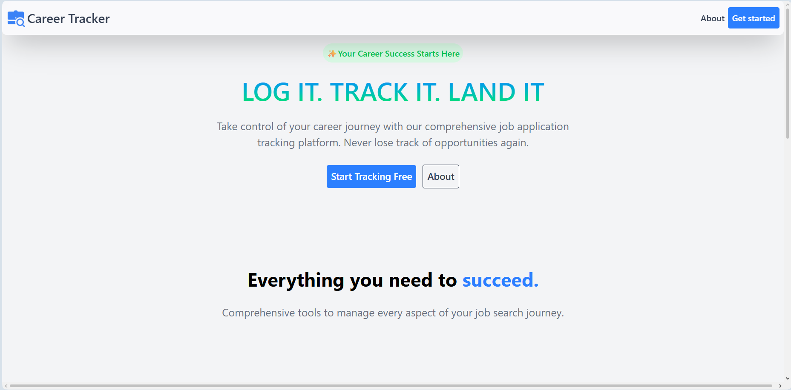
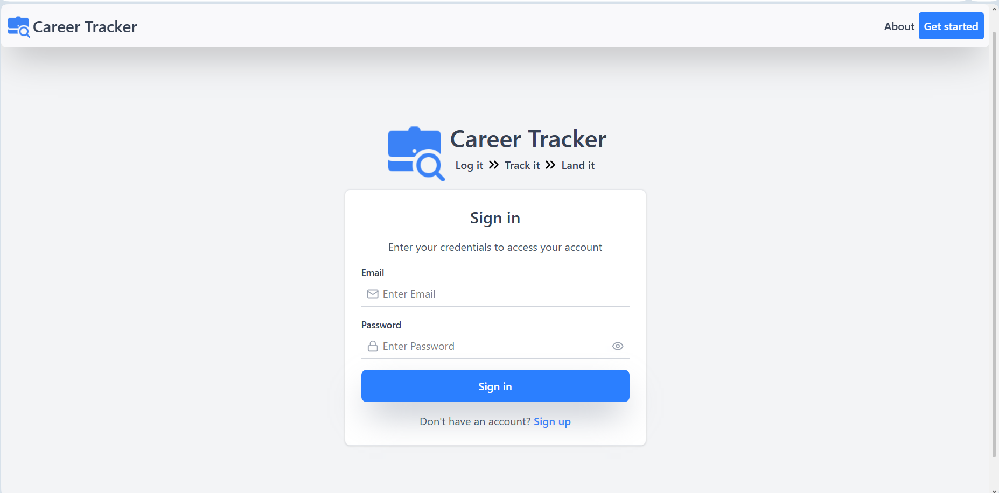
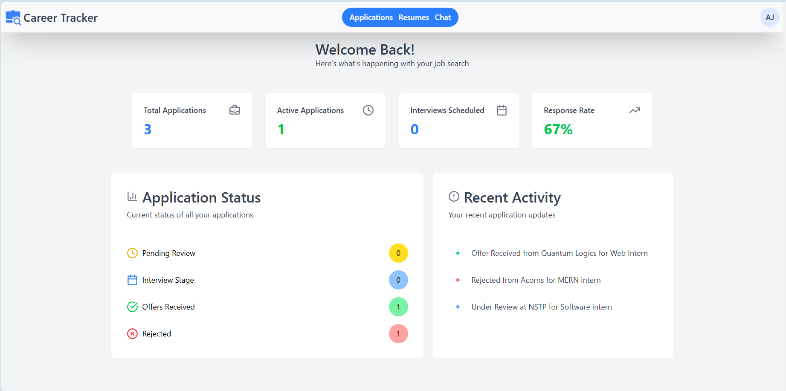
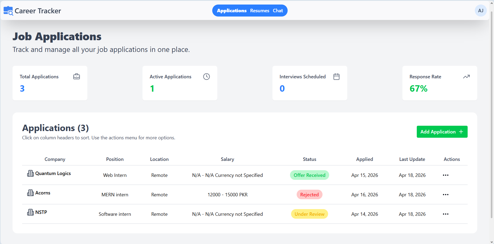
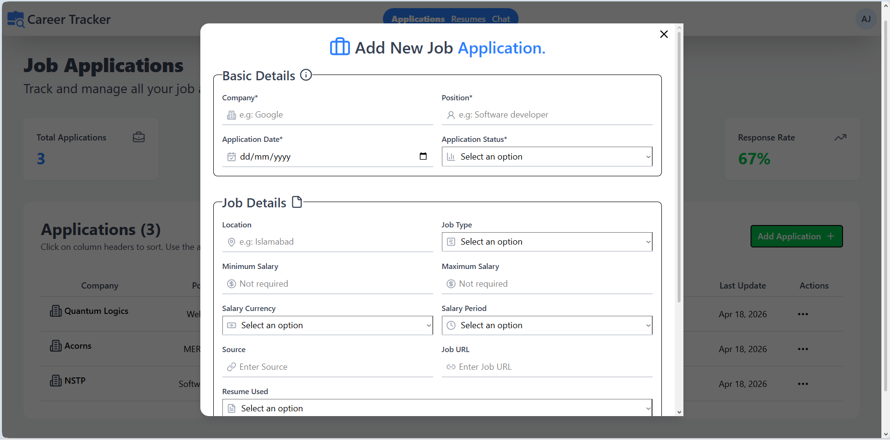
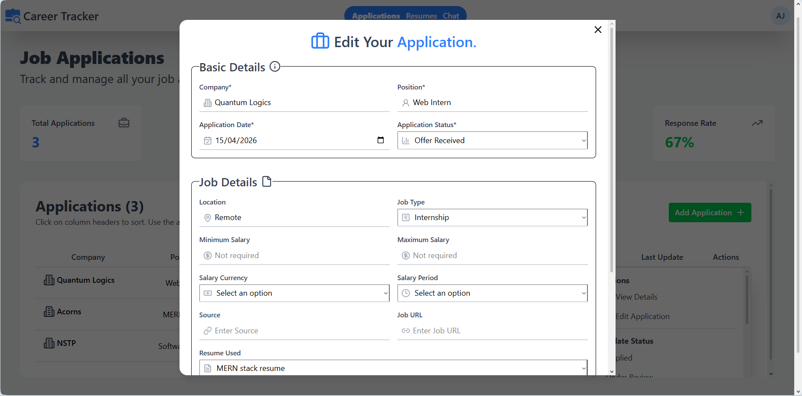
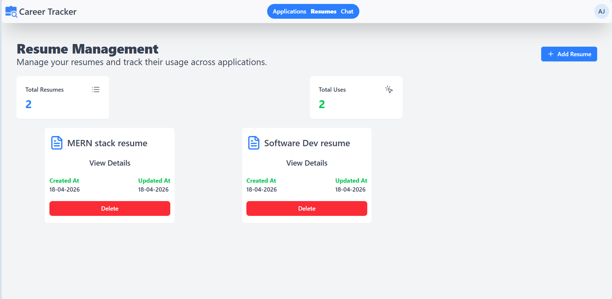
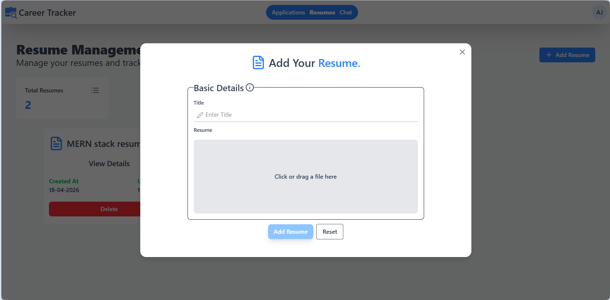
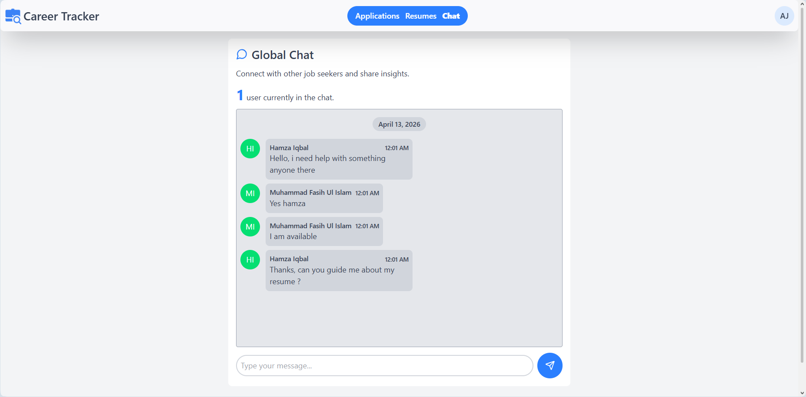

# Career Tracker

A full-stack job application tracking system built with the MERN stack. Career Tracker lets users log and manage their job applications, upload resumes, view dashboard analytics, and communicate in a real-time global chat room.

> Built during my internship at Brackets Software House.

---

## Demo

🔗 Live Demo: [Career Tracker](https://career-tracker-tau.vercel.app)

🔗 Demo Video: [Youtube Link](https://youtu.be/kNaLIu3VhTw)

## Screenshots



















---

## Features

- **Application Tracking** — Create, update, and delete job applications with full CRUD support
- **Dashboard Analytics** — Real-time stats including total applications, active applications, interviews scheduled, and response rate
- **Resume Management** — Upload, download, and delete resumes (PDF, Word, TXT) via Multer file handling
- **Real-Time Chat** — Global chat room powered by Socket.IO with online user count, message history, and profanity filtering
- **Authentication** — JWT-based auth with protected routes and secure cookie management

---

## Tech Stack

**Frontend**

- React + Vite
- Tailwind CSS
- Axios
- Socket.IO Client

**Backend**

- Node.js + Express.js
- MongoDB + Mongoose
- Socket.IO
- Multer
- JSON Web Tokens (JWT)

---

## Project Structure

```
Career-Tracker/
├── Client/
│   ├── src/
│   │   ├── pages/          # Dashboard, Applications, Resumes, Chat
│   │   ├── components/     # Reusable UI components
│   │   └── Router/         # Protected and public routes
├── Server/
│   ├── controllers/        # Auth, application, resume logic
│   ├── routes/             # API route definitions
│   ├── middlewares/        # Auth validation, file upload
│   └── app.js              # Express + Socket.IO setup
```

---

## Getting Started

### Prerequisites

- Node.js v18+
- MongoDB instance (local or Atlas)

### Installation

```bash
# Clone the repository
git clone https://github.com/Fasih-ulislam/career-tracker.git
cd career-tracker

# Install server dependencies
cd Server
npm install

# Install client dependencies
cd ../Client
npm install
```

### Environment Variables

Create a `.env` file in the `Server` directory:

```env
PORT=5000
MONGO_URI=your_mongodb_connection_string
JWT_SECRET=your_jwt_secret
```

### Run the App

```bash
# Start the backend
cd Server
npm run dev

# Start the frontend
cd Client
npm run dev
```

---

## Author

**Muhammad Fasih Ul Islam**

- GitHub: [@Fasih-ulislam](https://github.com/Fasih-ulislam)
- LinkedIn: [muhammad-fasih-cs](https://linkedin.com/in/muhammad-fasih-cs)
